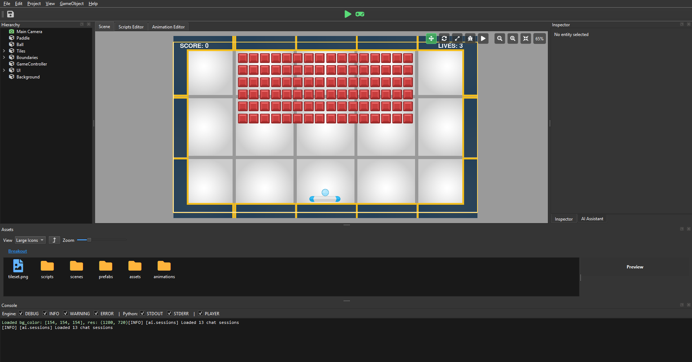
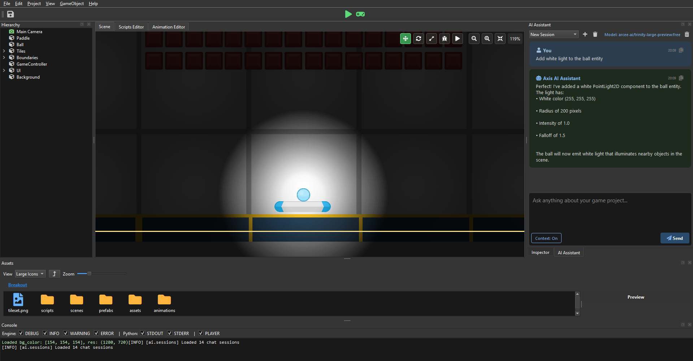
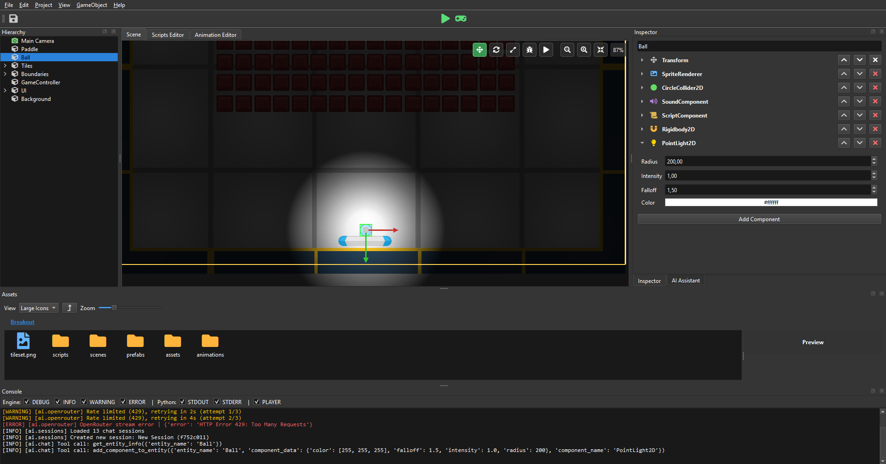

# axispy

  

AxisPy Game Engine is a Python-based 2D game engine designed for developers who are passionate about both Python and game development in AI era.

Built on top of Pygame, AxisPy aims to provide a structured and intuitive development experience inspired by modern engines, while staying fully within the Python ecosystem.

Instead of competing with high-performance engines, AxisPy focuses on:

- **Developer experience first**: clean architecture, readable code, and fast iteration
- **Python-native workflows**: no need to switch languages or toolchains
- **Rapid prototyping**: ideal for experimenting, learning, and building indie projects
- **Extensibility**: leverage Python's vast ecosystem (AI, data, tools, etc.) directly in your games

AxisPy is especially suited for:

- Indie developers who prefer Python
- Educators and students learning game development
- Developers exploring game ideas without heavy engine overhead

*AxisPy is not about replacing existing AAA engines, it's about empowering Python developers to create games in an environment they already love.*

## Screenshots

  
   <em>Scene Editor with a Breakout game scene</em>

  
   <em>AI Assistant panel showing AI Assistant adding a light component to the ball</em>

  
   <em>Inspector panel</em>

